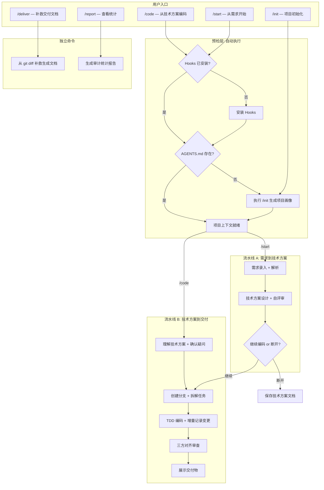

# Exoskeleton 核心流程与原理说明

## 零、文档分工与权威来源

为避免规范漂移，文档分工如下：

- `docs/plugin-core-workflow.md`：**机制权威文档（Single Source of Truth）**，定义流程、规则、门禁、审计与交付标准。
- `docs/user-guide.md`：**操作手册**，仅保留步骤、核心流程图与跳转入口，不重复机制细节。
- `docs/governance-checklist.md`：治理基线检查清单，用于启动前、交付前快速自检。
- `docs/operations-runbook.md`：故障排查与恢复 Runbook。
- `docs/profile-extension-template.md`：技术栈 Profile 扩展模板。

当不同文档描述冲突时，以本文件为准。

## 一、定位与核心理念

### 什么是 Exoskeleton

Exoskeleton 是一套面向企业级项目的 **AI 编程治理框架**，以 Cursor IDE 插件的形式交付。它解决的核心问题是：

> **如何让 AI 在企业项目中安全、规范、可追溯地交付需求。**

它不是一个通用的 AI 编程助手，而是一套将企业的开发规范、质量标准、协作流程固化到 AI 行为中的治理体系。

### 与 Superpowers 等通用工具的区别

| 维度 | 通用 AI 工具（如 Superpowers） | Exoskeleton |
|------|------|------|
| 解决的问题 | AI 怎么写好代码 | AI 怎么在我们的项目里安全地交付需求 |
| 入口 | 一个模糊的想法 | 双入口：从需求文档或从技术方案文档 |
| 流程 | 单一线性，不可断开 | 双流水线，设计和编码可断开/续接 |
| 规范 | 内置通用最佳实践 | 共享规范 + 项目特有规范，可组合 |
| 安全机制 | 无 | 模式隔离、危险命令拦截、路径门禁、审计日志 |
| 交付物 | 代码 | 代码 + 变更清单 + 技术参考文档 |
| 可追溯性 | git commit | 需求编号贯穿全链路 |

二者不是替代关系。Superpowers 提供通用方法论（Layer 0），Exoskeleton 在其之上叠加企业规范和治理机制（Layer 1-3）。允许共存，冲突时 Exoskeleton 优先。

### 三层治理模型

```
Layer 3: Hooks（行为拦截层）
         ↑ 拦截危险操作、强制模式门禁、记录审计日志
Layer 2: Rules（规范约束层）
         ↑ 编码规范、架构约束、命名规范、事务规范
Layer 1: Skills（能力指导层）
         ↑ 需求分析、方案设计、方案评审、编码实施、测试设计、交付
Layer 0: Cursor IDE + AI 模型（基础能力）
```

- **Skills** 告诉 AI "怎么做"：如何分析需求、如何设计技术方案、如何写测试
- **Rules** 告诉 AI "必须遵守什么"：COLA 分层、命名规范、事务边界
- **Hooks** 在 AI 行为发生时"拦截和审计"：阻止危险命令、记录编辑日志、强制模式切换

---

## 二、插件结构

### 目录布局

```
coding-exoskeleton/
├── .cursor-plugin/
│   └── plugin.json                    # 插件清单文件
│
├── skills/
│   ├── shared/                        # 所有项目通用
│   │   ├── requirement-intake/        # 需求录入与解析
│   │   ├── tech-design/               # 技术方案设计
│   │   ├── design-review/             # 方案自评审
│   │   ├── implementation-planning/   # 实施计划与任务拆解
│   │   ├── coding/                    # 编码实施
│   │   ├── testing/                   # 测试策略与执行
│   │   ├── delivery/                  # 交付物格式化与汇总
│   │   ├── performance-analysis/      # 性能分析
│   │   ├── context-compaction/        # 战略性上下文压缩
│   │   ├── verification-loop/         # 结构化验证循环
│   │   └── project-profiling/         # 项目画像生成
│   │
│   ├── cola-java/                     # COLA Java 项目特有
│   │   ├── cola-architecture/         # COLA 架构设计指导
│   │   ├── cola-naming/               # COLA 命名规范指导
│   │   └── common-components/         # 公共组件使用指南
│   ├── {profile-id}/                  # 按需扩展（目录名即 Profile ID）
│   └── ...
│
├── rules/
│   ├── shared/                        # 通用规则
│   │   ├── task-contract.mdc          # 任务契约规则
│   │   ├── work-mode-policy.mdc       # 工作模式策略规则
│   │   ├── context-compaction.mdc     # 战略性上下文压缩规则
│   │   ├── subagent-orchestration.mdc # 子代理编排规则
│   │   └── performance.mdc            # 通用性能规则
│   │
│   ├── cola-java/                     # COLA Java 项目特有规则
│   │   ├── cola-architecture.mdc      # COLA 分层架构规则
│   │   ├── java-naming.mdc            # Java 命名规范
│   │   ├── transaction-executor.mdc   # 事务管理规则
│   │   ├── mq-consumer.mdc            # MQ 消费规则
│   │   └── performance.mdc            # 项目特有性能约束
│   ├── {profile-id}/                  # 按需扩展（结构同上）
│   └── ...
│
├── commands/                          # 用户可见的斜杠命令
│   ├── init.md                        # /init  → 项目初始化
│   ├── start.md                       # /start → 流水线 A 入口
│   ├── code.md                        # /code  → 流水线 B 入口
│   ├── deliver.md                     # /deliver → 交付物补救生成（可选）
│   └── report.md                      # /report → 查看统计报告
│
├── agents/                            # 子代理定义
│   ├── code-reviewer.md               # 代码评审子代理
│   ├── security-reviewer.md           # 安全审计子代理
│   ├── build-error-resolver.md        # 构建错误修复子代理
│   ├── architect.md                   # 架构决策审查子代理
│   ├── tdd-guide.md                   # TDD 引导子代理
│   └── doc-updater.md                 # 文档完整性子代理
│
├── hooks/                             # 只含脚本；hooks 配置由 install.ps1 写入 ~/.cursor/hooks.json
│
└── docs/
    └── plugin-core-workflow.md        # 本文档
```

### 共享 + 项目特有的组合机制

插件内的 skills 和 rules 分为两层：

- **shared/**：所有项目通用的能力和规范（需求分析、方案设计、性能规则等）
- **cola-java/**（示例，或其他项目标识）：特定技术栈的能力和规范

#### 技术栈 Profile 机制

Cursor 加载插件时，会注册 `skills/` 和 `rules/` 下的所有文件。技术栈的"选择性激活"通过以下机制实现：

1. **`/init` 命令**（或首次使用 `/start`、`/code` 时自动引导）扫描项目，推断技术栈，生成 `AGENTS.md`（项目画像文件，保存在业务项目根目录）
2. `AGENTS.md` 的 frontmatter 中声明 `techStack` 字段（如 `cola-java`），同时写入 `.cursor/harness-config.json`
3. 项目特有的 skills（如 `cola-architecture`）在执行前先读取 `AGENTS.md`，检查技术栈是否匹配，不匹配则自动跳过
4. 项目特有的 rules 通过 `globs` 限制适用范围（如 `*.java` 文件），非目标语言的文件不触发

**预设 Profile**：

| Profile | 匹配条件 | 激活的专项内容 |
|---------|----------|---------------|
| `cola-java` | `pom.xml` + COLA 依赖 + COLA 目录结构 | `skills/cola-java/*` + `rules/cola-java/*` |
| 自定义 | 用户手动描述 | 仅 `skills/shared/*` + `rules/shared/*` |

> **扩展说明**：`spring-boot`、`react-ts`、`go-service` 等 Profile 为规划中的扩展方向，当前版本尚未内置。欢迎按 `docs/profile-extension-template.md` 模板贡献新 Profile。

#### AGENTS.md 的作用

`AGENTS.md` 是项目画像文件，遵循 Cursor 生态约定放在业务项目根目录。它的作用：

- **持久化项目上下文**：避免每次会话都重新扫描项目，节省 token
- **技术栈声明**：决定哪些专项 skills/rules 被激活
- **编码规范统一**：让不同会话、不同开发者对同一项目有一致的理解
- **AI 行为锚点**：所有流程（/start、/code）启动时先读取此文件建立上下文

---

## 三、核心工作流：双流水线设计

### 设计背景

实际开发中，开发者会遇到两种任务形态：

1. **从需求开始**：拿到需求文档，自己做技术方案，再编码交付
2. **从技术方案开始**：拿到已过审的技术方案（自己之前写的，或架构师/其他开发者输出的），直接编码交付

因此，工作流设计为两条**可独立运行、可断开续接**的流水线：

- **流水线 A**（`/start` 触发）：需求 → 技术方案
- **流水线 B**（`/code` 触发）：技术方案 → 编码 → 测试 → 交付

两条流水线通过**需求编号（SV-ID）**串联。需求编号是跨团队协作的唯一 key，贯穿技术方案、分支命名、commit message、变更清单、技术参考文档全链路。

### 全局流程图

下图展示了 Exoskeleton 的全部 5 个入口及其交互关系：



### 各阶段涉及的组件总览

| 阶段 | Skills | Rules | Hooks | Agents |
|------|--------|-------|-------|--------|
| **/init** | `project-profiling` | - | - | - |
| **/start A1** | `requirement-intake` | `task-contract`, `work-mode-policy` | `before-submit-prompt-lite`, `before-shell-execution`, `after-file-edit` | - |
| **/start A2** | `tech-design`, `design-review`, `cola-architecture`* | `task-contract`, `work-mode-policy`, `performance` | 同上 | `architect`（复杂方案时） |
| **/code B0** | - | `task-contract`, `work-mode-policy` | `before-submit-prompt-lite` | - |
| **/code B1** | `implementation-planning`, `testing`, `coding` | `task-contract` | `before-submit-prompt-lite` | - |
| **/code B2** | `coding`, `cola-naming`*, `common-components`* | `cola-architecture`*, `java-naming`*, `transaction-executor`*, `mq-consumer`*, `performance`*, `performance`(shared), `task-contract` | `before-shell-execution`, `after-file-edit`, `pre-tool-use`** | Subagent, `tdd-guide` |
| **/code B3** | `verification-loop`, `performance-analysis`, `delivery` | - | `after-file-edit` | `code-reviewer`, `build-error-resolver`（V1失败时）, `security-reviewer`（V4后） |
| **/code B4** | `delivery` | - | - | `doc-updater` |
| **/deliver** | `delivery` | - | - | - |
| **/report** | - | - | - | - |

\* 仅当 AGENTS.md 中 techStack = cola-java 时激活
\** 仅 Full 档位

---

## 四、流水线 A 详解：从需求到技术方案

### A1: 需求录入（/start）

**触发方式**：
- `/start SV-34577`（带需求编号）
- `/start 给订单列表加一个按供应商筛选的功能`（口头需求，插件会要求补充 SV-ID）

**核心动作**：

1. **解析需求**：
   - 有文档时：提取需求编号、标题、描述、验收标准
   - 口头需求时：通过对话提炼需求要素，**要求用户提供需求编号**（不可省略）

2. **读取项目上下文**：优先使用 `AGENTS.md` 中的项目画像（技术栈、架构模式、模块结构），仅在画像信息不足时补充扫描

3. **建立任务契约**：
   - 模式 → 设计模式（初始强制）
   - 需求编号 → 必填
   - 允许写入路径 → 仅文档目录
   - 禁止项 → 不修改代码、不执行构建命令

**为什么要求需求编号**：需求编号是串起技术方案、分支、变更清单、技术参考文档以及跨团队协作（测试、产品、架构师）的唯一 key。没有它，后续的可追溯性无法建立。

### A2: 技术方案设计

**核心动作**：

1. **澄清**：逐个问题与用户确认（一次一个，优先选择题），聚焦影响模块、数据流、非功能要求
2. **方案设计**：提出 2-3 种方案，附取舍分析和推荐
3. **输出文档**：结构化技术方案文档（八部分结构）：
   - 功能概述与边界
   - 核心业务流程
   - 数据结构设计
   - 关键设计决策
   - 可观测性设计
   - 测试策略
   - 风险与实施
   - 实施进度（由 /code 流水线自动维护）
4. **自评审**：自动执行方案评审，检查 Critical / Important / Nice-to-have 问题
5. **架构审查**（复杂方案时）：当方案涉及新增模块、引入新技术组件、跨模块数据流变更或数据模型重构时，委派 `architect` agent 进行架构决策审查

**产出**：`docs/design/SV-34577-tech-design.md`

**用户门禁**：方案必须经用户确认才能继续。

### A3: 流水线 A 出口

方案确认后，用户有两个选择：

**上下文压缩**：方案确认后，执行 `context-compaction` skill 评估是否需要压缩上下文（A→B 衔接是关键压缩点）。

**继续编码**：直接衔接进入流水线 B。此时无需重新理解技术方案，上下文已在当前会话中。

**断开**：仅输出技术方案文档，流程结束。后续可以：
- 自己在新会话中通过 `/code SV-34577` 继续
- 将文档交给其他开发者接手

断开后的关键约束：技术方案文档中必须包含需求编号，这是续接的唯一依据。

---

## 五、流水线 B 详解：从技术方案到交付

### B0: 技术方案接入（/code）

**两种进入方式**：

**方式一：从流水线 A 衔接**
- 上下文已就绪，跳过理解和确认环节，直接进入 B1

**方式二：独立进入**
- 触发：`/code SV-34577` 并附带或指定技术方案文档
- 这份文档可能来自自己之前的输出，也可能来自架构师或其他开发者

**独立进入时的关键流程——先理解，再确认，后编码**：

```
理解文档 → 识别疑问（歧义/缺失/矛盾）→ 与用户逐一确认 → 确认完成 → 开始编码
```

1. **要求需求编号**：SV-ID 必填，未提供则要求补充
2. **完整理解文档**：阅读并提炼需求背景、核心方案、影响范围
3. **主动识别疑问**：分三类列出：
   - **歧义**：文档中存在多种理解方式的描述
   - **缺失**：文档未覆盖但编码必需的细节（异常处理、边界值等）
   - **矛盾**：文档内部或与项目现状不一致的地方
4. **与用户逐一确认**：展示疑问列表，全部确认后才继续
5. **检查实施进度**：检查技术方案文档中是否存在「八、实施进度」段落。如果存在，说明这是一个进行中的需求，读取进度段落，从未完成处继续；如果不存在，按首次编码执行。

**为什么要这样做**：技术方案文档来自不同角色，AI 不能假设文档是完美的。先理解再确认，可以在编码开始前消除理解偏差，避免写出与方案不一致的代码。

### B1: 实施准备

1. **切换到编码模式**：允许写代码、执行构建命令
2. **创建 feature 分支**：`feature/SV-34577-brief-description`
3. **拆解任务清单**：
   - 每个任务粒度 2-5 分钟
   - 明确影响文件、所属层级、对应测试文件
   - **标注任务间依赖关系**（用于后续判断是否可并行）
4. **定义测试策略**：核心路径、边界条件、异常路径、Mock 策略
5. **初始化变更记录文档**：创建 `docs/delivery/SV-xxxxx-changelist.md` 骨架
6. **初始化实施进度**：在技术方案文档中创建「八、实施进度」段落，填入任务清单，状态设为"编码中"

### B2: 编码实施

**执行策略**：根据任务依赖图自动决策

- **无依赖的独立任务**：Subagent 并行执行，每个 Subagent 携带完整上下文和规范约束
- **有依赖的任务**：当前会话顺序执行

**每个任务遵循 TDD + Record 节奏**：
```
写测试（红）→ 确认失败 → 写实现（绿）→ 确认通过 → 提交（commit 关联 SV-ID）→ 更新变更记录文档 → 更新实施进度
```

第 6 步"更新变更记录"是本次改造的核心变化：每次 commit 后，立即将本次变更追加到 `docs/delivery/SV-xxxxx-changelist.md`，包含变更文件、变更类型、功能说明、接口信息、高风险标注。此刻 AI 对变更的理解最准确（刚写完代码），记录的精度最高。

**TDD 纪律保障**：每个任务 commit 后，由 `tdd-guide` agent 自动检查 TDD 节奏完整性（测试是否先于实现、覆盖率是否达标）。

**并行执行完成后**：汇总结果 → 汇总各 Subagent 的变更记录 → 检查冲突 → 集成验证

**强制约束（由 Rules 保障）**：
- 架构分层规范（如 COLA：domain 不依赖 infrastructure）
- 命名规范
- 事务管理规范
- 性能规范（避免 N+1、循环内 RPC 等）

### B3: 代码审查与对齐

B3 阶段从原来的"验证"升级为"代码审查与对齐"，在保留测试和性能检查的基础上，增加了三方对齐审查，同时产出交付文档。

B3 阶段由 `verification-loop` skill 编排，将原来的单次线性检查升级为结构化验证循环，支持 5 个维度（构建 → 测试 → 性能 → 对齐 → 规范）的增量重验和检查点保存。

#### 3.1 全量测试与性能检查

1. **全量单元测试**：运行项目所有测试
2. **性能检查**：N+1 查询扫描、批量操作检查、异步处理评估

构建失败时，由 `build-error-resolver` agent 自动诊断错误原因并给出修复建议。

**门禁**：测试不通过，不允许继续。

#### 3.2 三方对齐审查

以三份材料为输入，进行系统化的对齐检查：

| 输入材料 | 来源 | 作用 |
|----------|------|------|
| 变更记录文档 | B2 编码阶段增量维护 | 开发者视角的变更说明 |
| git diff | `git diff main...HEAD` | 代码变更的客观事实 |
| 技术方案文档 | `/start` 或外部输入 | 业务需求的原始意图 |

**检查维度**：

1. **变更记录完整性**（记录 vs diff）：所有实际变更是否都被记录？有无遗漏？
2. **业务对齐度**（记录 + diff vs 技术方案）：代码是否在业务需求上跑偏？有无超出方案范围的变更？有无方案要求但未实现的功能？
3. **架构规范、代码质量、测试覆盖、高风险变更**（原有评审维度保留）

**门禁**：发现 Critical 级别的业务偏差时，必须修复后重新审查。

#### 3.3 安全审计

V4 对齐验证通过后，由 `security-reviewer` agent 执行安全维度审查（注入攻击、认证授权、数据安全、业务逻辑安全、依赖与配置安全）。当变更涉及接口层、权限相关、数据库操作或文件处理时，安全审计为必须执行。

#### 3.4 审查产出

审查阶段同时产出三份文档：

1. **代码评审报告**：对齐检查结果 + 问题列表（Critical / Warning / Info）（保存到 `docs/delivery/SV-xxxxx-review-report.md`）
2. **变更清单定稿**：对 B2 阶段积累的变更记录做最终格式化，补齐遗漏，确认与 diff 一致
3. **技术参考文档**：从变更记录和审查结果中提炼，面向测试人员（保存到 `docs/delivery/SV-xxxxx-tech-ref.md`）

**为什么交付文档在审查阶段产出**：

- 变更清单在编码阶段已经增量积累了 80% 的内容，审查阶段只做"最后一公里"的校验和格式化
- 技术参考文档需要对变更的整体理解，审查阶段刚好完成了全面的代码审阅，此刻产出最合适
- 不需要额外的 token 消耗——审查过程本身已经阅读了所有变更，文档是审查的副产品

**验证循环门禁**：所有 5 个维度通过（✅ 或 ⚠️）后综合评判为 PASS，才能进入 B4。任何维度 ❌ 时进入修复→重验循环（最多 3 次），超过后需人工介入。验证过程记录在 `docs/delivery/SV-xxxxx-verification.md`。

### B4: 交付

审查通过后，由 `doc-updater` agent 检查所有交付文档的完整性、格式合规性和与代码变更的一致性，确认齐套后进入交付展示。

所有交付物已就绪，直接展示并让用户选择：

**交付物清单**：

| 交付物 | 路径 | 产出时机 |
|--------|------|----------|
| 变更清单 | `docs/delivery/SV-xxxxx-changelist.md` | B2 增量维护，B3 定稿 |
| 技术参考文档 | `docs/delivery/SV-xxxxx-tech-ref.md` | B3 审查阶段产出 |
| 代码评审报告 | `docs/delivery/SV-xxxxx-review-report.md` | B3 审查阶段产出 |
| 验证检查点 | `docs/delivery/SV-xxxxx-verification.md` | B3 验证循环产出 |
| Feature 分支代码 | `feature/SV-xxxxx-...` | B2 编码阶段 |

用户选择处理方式：
- 提交 PR（自动填写描述，附变更清单和技术参考文档）
- 本地合并
- 保留分支

> **注意**：正常流程下无需使用 `/deliver` 命令。`/deliver` 仅作为补救手段，用于文档丢失或未经 `/code` 流程时的事后生成。

---

## 六、Harness 治理机制详解

### 模式隔离

整个流程中存在两种模式，由 Hooks 强制执行：

| 模式 | 触发 | 允许操作 | 禁止操作 |
|------|------|----------|----------|
| 设计模式 | /start 进入，或流水线 A 中 | 读代码、写文档 | 修改代码、执行构建/提交命令 |
| 编码模式 | 用户确认编码后，或 /code 进入 | 读写代码、执行构建/测试 | 危险命令（force push、drop table 等） |

模式切换必须经过用户确认，不会自动切换。

### 任务契约

每个任务开始时自动建立契约，包含：
- 需求编号（必填）
- 当前模式
- 允许写入的路径
- 禁止操作列表
- 验收标准

契约在整个任务周期内由 Hooks 持续监控和执行。

### 事件审计

所有关键操作记录到 `harness-events.jsonl`：

```json
{"ts":"2026-04-15T10:30:00","event":"mode_change","hook":"beforeSubmitPrompt","detail":"mode=design","outcome":"allow"}
{"ts":"2026-04-15T10:35:12","event":"edit","hook":"afterFileEdit","detail":"path=src/OrderController.java","outcome":"logged"}
{"ts":"2026-04-15T10:36:05","event":"deny","hook":"beforeShellExecution","detail":"dangerous: git push --force","outcome":"deny"}
```

可通过 `/report` 命令查看统计：模式分布、拒绝命令 Top 10、编辑路径分类等。

建议将 `/report` 指标分为两层：

1. **运行态指标（当次）**
   - 总事件数、拦截次数、编辑次数、模式分布
2. **趋势指标（周/月）**
   - 拦截率（拦截次数/命令总数）
   - 一次通过率（无需返工进入交付的任务占比）
   - 交付补救率（通过 `/deliver` 补文档的任务占比）
   - 文档完整率（交付阶段三份核心文档齐套占比）

趋势指标用于驱动 rules/skills/hooks 的持续迭代，而不只做审计留痕。

### Hooks 治理矩阵

下表展示了每个 Hook 在各入口/阶段中的具体行为：

| Hook | /init | /start (A1-A3) | /code (B0) | /code (B1-B4) | /deliver | /report |
|------|:-----:|:---------------:|:----------:|:--------------:|:--------:|:-------:|
| `after-file-edit` | - | 审计文档编辑 | 审计文档编辑 | 审计代码编辑 | 审计 | - |
| `before-shell-execution` | - | 拦截构建/提交 | 拦截构建/提交 | 允许构建/测试, 拦截危险命令 | 允许 | - |
| `before-submit-prompt-lite` | - | 记录 design 模式 | 记录模式切换 | 记录 coding 模式 | - | - |
| `pre-tool-use` (Full 档位) | - | 路径门禁：仅文档目录 | 路径门禁 | 路径门禁：目标模块 | - | - |

说明：
- `/init` 为只读扫描 + 生成配置，不受 Hooks 约束
- `/deliver` 和 `/report` 为独立工具命令，不涉及模式切换

---

## 七、典型使用场景

### 场景 1：一个人从需求跑到底

开发者拿到需求文档，独立完成从方案到交付的全流程。

```
/start SV-34577
  → 解析需求 → 扫描项目 → 建立契约（设计模式）
  → 澄清问题 → 设计方案 → 自评审 → 用户确认方案
  → 选择"继续编码"
  → 创建分支 → 拆解任务 → TDD 编码（每次 commit 同步更新变更记录）
  → 全量测试 → 性能检查 → 三方对齐审查（产出评审报告 + 测试参考文档）
  → 展示交付物 → 提交 PR
```

### 场景 2：只做技术方案，后续再编码或交给别人

架构师或 Tech Lead 做方案评审，不直接编码。

```
/start SV-34577
  → 需求解析 → 技术方案 → 用户确认
  → 选择"断开"
  → 输出 docs/design/SV-34577-tech-design.md
  → 结束
```

### 场景 3：拿到别人的技术方案，直接编码

开发者从架构师或其他开发者处拿到已过审的技术方案。

```
/code SV-34577（附带技术方案文档）
  → 理解文档 → 识别疑问（歧义/缺失/矛盾）→ 与用户确认
  → 创建分支 → 拆解任务 → TDD 编码（增量维护变更记录）
  → 全量测试 → 三方对齐审查 → 展示交付物 → PR
```

### 场景 4：自己之前做的方案，新会话继续

上一次会话断开后，在新会话中继续。

```
/code SV-34577（指向之前输出的技术方案文档）
  → 理解文档 → 检查实施进度段落 → 发现已完成 T-001、T-002
  → 跳过已完成任务，从 T-003 继续编码
  → 测试 → 审查 → PR
```

---

## 八、需求编号的全链路贯穿

需求编号（SV-ID）是整个体系的核心串联 key：

```
SV-34577
  │
  ├── AGENTS.md                                        /init 生成, 全流程读取
  │
  ├── 技术方案: docs/design/SV-34577-tech-design.md        /start 产出, /code 输入
  │
  ├── Git 分支: feature/SV-34577-order-filter              /code B1 创建
  │
  ├── Commit: "feat(SV-34577): ..."                        /code B2 产出
  │
  ├── 变更清单: docs/delivery/SV-34577-changelist.md       /code B1 初始化, B2 增量更新, B3 定稿
  │
  ├── 技术参考文档: docs/delivery/SV-34577-tech-ref.md     /code B3 产出
  │
  ├── 代码评审报告: docs/delivery/SV-34577-review-report.md    /code B3 产出
  │
  ├── 验证检查点: docs/delivery/SV-34577-verification.md    /code B3 产出
  │
  ├── PR 描述: 自动关联以上所有文档                                /code B4 产出
  │
  └── 审计日志: harness-events.jsonl                            全流程审计
```

无论流水线 A 和 B 是在同一会话中完成，还是跨会话/跨人员断开续接，SV-ID 都能将所有产出物串联起来。

---

## 九、Subagent 并行执行原理

### 什么时候并行

在 B2（编码实施）阶段，任务清单拆解后会标注任务间的依赖关系。依赖分析逻辑：

- **独立任务**：不依赖其他任务的输出，不修改相同文件 → 可并行
- **有依赖的任务**：依赖其他任务创建的接口/类/数据结构 → 必须顺序

### 并行执行的方式

```
主会话:
  ├── 分析依赖图
  ├── 将独立任务分组
  ├── 为每组启动一个 Subagent
  │     ├── Subagent 1: Task A（携带完整上下文 + 规范约束）
  │     ├── Subagent 2: Task B
  │     └── Subagent 3: Task C
  ├── 等待所有 Subagent 完成
  ├── 汇总结果
  ├── 汇总各 Subagent 的变更记录到变更清单文档
  ├── 检查文件冲突
  ├── 运行集成验证
  └── 继续执行有依赖的顺序任务
```

每个 Subagent 遵循与主会话相同的 TDD + Record 节奏和规范约束（Rules 对 Subagent 同样生效）。Subagent 完成后返回修改的文件列表、测试结果、commit hash 以及本任务的变更记录，由主会话负责汇总到变更清单文档。

### 专职子代理编排

除 B2 阶段的并行编码 Subagent 外，Exoskeleton 还在流水线各节点部署了 5 个专职子代理，每个子代理绑定特定阶段，遵循上下文收窄协议（详见 `subagent-orchestration` 规则）：

| 子代理 | 绑定阶段 | 触发条件 | 职责 |
|--------|---------|---------|------|
| `architect` | A2 | 方案涉及新模块/新技术/跨模块变更时 | 架构决策审查 |
| `tdd-guide` | B2 | 每个任务 commit 后 | TDD 节奏完整性检查 |
| `build-error-resolver` | B3 (V1) | 构建验证失败时 | 构建错误诊断与修复建议 |
| `security-reviewer` | B3 (V4 后) | 对齐验证通过后 | 安全维度审查 |
| `doc-updater` | B4 | 验证循环 PASS 后 | 交付文档完整性检查 |

所有专职子代理遵循统一的上下文收窄协议：主 Agent 只传递该子代理「必须接收」的最小信息集，剔除「禁止接收」的无关内容，子代理以三段式结构（结论 + 问题列表 + 建议）返回结果，由主 Agent 整合。

---

## 十、总结

Exoskeleton 的核心价值可以用一句话概括：

> **将企业开发流程中"人盯人"的规范执行，变成"系统自动化"的治理机制。**

它通过：
- **双流水线**适配实际开发中"方案"和"编码"可能由不同人/不同时间完成的现实
- **需求编号**贯穿全链路，保证跨团队可追溯
- **三层治理**（Skills + Rules + Hooks）确保 AI 输出的稳定性和规范性
- **Subagent 并行**提升编码效率
- **增量变更记录**在编码过程中同步维护文档，避免事后回溯的精度损失和 token 浪费
- **三方对齐审查**用变更记录 + diff + 技术方案三方对账，确保代码不偏离业务需求
- **结构化交付物**（变更清单 + 技术参考文档 + 评审报告）降低人工 review 和测试的理解成本
- **验证循环**编排构建、测试、性能、对齐、规范五个维度的结构化验证，支持增量重验和检查点断点续验
- **专职子代理**在流水线关键节点自动委派，通过上下文收窄协议防止子代理漂移
- **战略性上下文压缩**在阶段切换时主动压缩上下文，通过结构化快照确保关键信息不丢失
- **实施进度追踪**在技术方案文档中自动维护进度段落，支持跨会话断点续做

