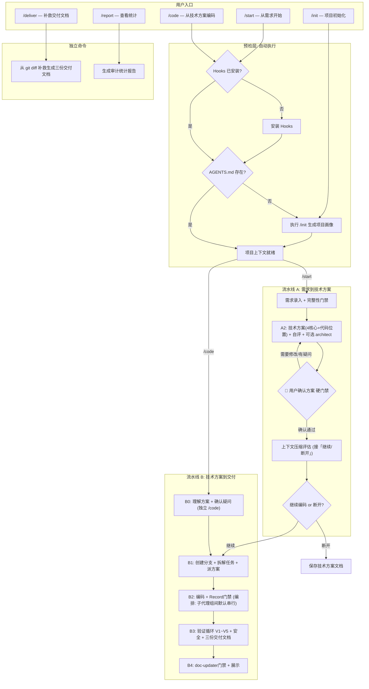

# Exoskeleton 核心流程与原理说明

## 零、文档分工与权威来源

为避免规范漂移，文档分工如下：

- `docs/plugin-core-workflow.md`：**机制总述与导航**，把双流水线、阶段划分、组件关系讲清楚，便于新人与评审对齐全局。
- `docs/user-guide.md`：**操作手册**，仅保留步骤、核心流程图与跳转入口，不重复机制细节。
- `docs/governance-checklist.md`：治理基线检查清单，用于启动前、交付前快速自检。
- `docs/operations-runbook.md`：故障排查与恢复 Runbook。
- `docs/profile-extension-template.md`：技术栈 Profile 扩展模板。

**可执行契约（实装来源）**：本仓库以 Markdown 资产形式交付治理逻辑，**以下路径为行为与判定的权威正文**（随代码/资产迭代而变）：

| 类型 | 路径 | 作用 |
|------|------|------|
| 斜杠命令 | `commands/*.md` | 各入口（如 `/code`、`/start`）的阶段步骤、门禁、子工具调用约定 |
| 规则 | `rules/**/*.mdc` | 始终或按 glob 启用的硬约束（任务契约、子代理编排、编码纪律等） |
| 技能 | `skills/**/SKILL.md` | 各阶段可复用的工作流与编排（如 `verification-loop`、`coding`） |
| 子代理 | `agents/*.md` | 子代理角色、上下文边界、输入输出格式 |

**冲突处理**：若本文件与上表中任一路径的表述不一致，**以上述实装文件为准**；更新流程时应先改命令/规则/技能/子代理文件，再同步本总述。

**跨文档关系**：`docs/user-guide.md` 与**其他** `docs/*.md` 若与本文件矛盾，以本总述优先；本总述若与**实装文件**矛盾，以**实装文件**优先。

## 一、定位与核心理念

### 什么是 Exoskeleton

Exoskeleton 是一套面向企业级项目的 **AI 编程治理框架**，以 Cursor IDE 插件的形式交付。它解决的核心问题是：

> **如何让 AI 在企业项目中安全、规范、可追溯地交付需求。**

它不是一个通用的 AI 编程助手，而是一套将企业的开发规范、质量标准、协作流程固化到 AI 行为中的治理体系。

### 与 Superpowers 等通用工具的区别

| 维度 | 通用 AI 工具（如 Superpowers） | Exoskeleton |
|------|------|------|
| 解决的问题 | AI 怎么写好代码 | AI 怎么在我们的项目里安全地交付需求 |
| 入口 | 一个模糊的想法 | 双入口：从需求文档或从技术方案文档 |
| 流程 | 单一线性，不可断开 | 双流水线，设计和编码可断开/续接 |
| 规范 | 内置通用最佳实践 | 共享规范 + 项目特有规范，可组合 |
| 安全机制 | 无 | 模式隔离、危险命令拦截、路径门禁、审计日志 |
| 交付物 | 代码 | 代码 + 变更清单 + 技术参考文档 |
| 可追溯性 | git commit | 需求编号贯穿全链路 |

二者不是替代关系。Superpowers 提供通用方法论（Layer 0），Exoskeleton 在其之上叠加企业规范和治理机制（Layer 1-3）。允许共存，冲突时 Exoskeleton 优先。

### 三层治理模型

```
Layer 3: Hooks（行为拦截层）
         ↑ 拦截危险操作、强制模式门禁、记录审计日志
Layer 2: Rules（规范约束层）
         ↑ 编码规范、架构约束、命名规范、事务规范
Layer 1: Skills（能力指导层）
         ↑ 需求分析、方案设计、方案评审、编码实施、测试设计、交付
Layer 0: Cursor IDE + AI 模型（基础能力）
```

- **Skills** 告诉 AI "怎么做"：如何分析需求、如何设计技术方案、如何写测试
- **Rules** 告诉 AI "必须遵守什么"：COLA 分层、命名规范、事务边界
- **Hooks** 在 AI 行为发生时"拦截和审计"：阻止危险命令、记录编辑日志、强制模式切换

---

## 二、插件结构

### 目录布局

```
coding-exoskeleton/
├── README.md
├── install.ps1                        # 安装入口：写入全局 hooks 配置
├── verify.ps1                         # 本地校验脚本
│
├── .cursor-plugin/
│   └── plugin.json                    # 插件清单文件
│
├── .cursor/
│   ├── harness-state.json             # 运行态状态文件（会话中更新）
│   └── hooks/logs/                    # 审计日志目录（运行态生成）
│
├── skills/
│   ├── shared/                        # 所有项目通用
│   │   ├── requirement-intake/        # 需求录入与解析
│   │   ├── tech-design/               # 技术方案设计
│   │   ├── design-review/             # 方案自评审
│   │   ├── implementation-planning/   # 实施计划与任务拆解
│   │   ├── coding/                    # 编码实施
│   │   ├── testing/                   # 测试策略与执行
│   │   ├── delivery/                  # 交付物格式化与汇总
│   │   ├── performance-analysis/      # 性能分析
│   │   ├── context-compaction/        # 战略性上下文压缩
│   │   ├── verification-loop/         # 结构化验证循环
│   │   └── project-profiling/         # 项目画像生成
│   │
│   ├── cola-java/                     # COLA Java 项目特有
│   │   ├── cola-architecture/         # COLA 架构设计指导
│   │   ├── cola-naming/               # COLA 命名规范指导
│   │   └── common-components/         # 公共组件使用指南
│   ├── {profile-id}/                  # 按需扩展（目录名即 Profile ID）
│   └── ...
│
├── rules/
│   ├── shared/                        # 通用规则
│   │   ├── task-contract.mdc          # 任务契约规则
│   │   ├── work-mode-policy.mdc       # 工作模式策略规则
│   │   ├── context-compaction.mdc     # 战略性上下文压缩规则
│   │   ├── subagent-orchestration.mdc # 子代理编排规则
│   │   ├── performance.mdc            # 通用性能规则
│   │   └── coding-discipline.mdc      # 编码纪律规则（最小变更、不投机扩展）
│   │
│   ├── cola-java/                     # COLA Java 项目特有规则
│   │   ├── cola-architecture.mdc      # COLA 分层架构规则
│   │   ├── java-naming.mdc            # Java 命名规范
│   │   ├── transaction-executor.mdc   # 事务管理规则
│   │   ├── mq-consumer.mdc            # MQ 消费规则
│   │   └── performance.mdc            # 项目特有性能约束
│   ├── {profile-id}/                  # 按需扩展（结构同上）
│   └── ...
│
├── commands/                          # 用户可见的斜杠命令
│   ├── init.md                        # /init  → 项目初始化
│   ├── start.md                       # /start → 流水线 A 入口
│   ├── code.md                        # /code  → 流水线 B 入口
│   ├── deliver.md                     # /deliver → 交付物补救生成（可选）
│   └── report.md                      # /report → 查看统计报告
│
├── agents/                            # 子代理定义
│   ├── code-reviewer.md               # 代码评审子代理
│   ├── security-reviewer.md           # 安全审计子代理
│   ├── build-error-resolver.md        # 构建错误修复子代理
│   ├── architect.md                   # 架构决策审查子代理
│   ├── tdd-guide.md                   # TDD 引导子代理
│   ├── coding-subagent.md             # 编码执行子代理契约
│   └── doc-updater.md                 # 文档完整性子代理
│
├── hooks/                             # Hook 脚本（hooks.json 由 install.ps1 写入用户目录）
│   ├── common.ps1
│   ├── before-submit-prompt.ps1
│   ├── before-submit-prompt-lite.ps1
│   ├── before-shell-execution.ps1
│   ├── after-file-edit.ps1
│   ├── pre-tool-use.ps1
│   └── harness-report.ps1
│
└── docs/
    ├── plugin-core-workflow.md        # 机制总述
    ├── user-guide.md                  # 用户手册
    ├── governance-checklist.md        # 治理基线检查清单
    ├── operations-runbook.md          # 故障处理 Runbook
    └── profile-extension-template.md  # Profile 扩展模板
```

### 共享 + 项目特有的组合机制

插件内的 skills 和 rules 分为两层：

- **shared/**：所有项目通用的能力和规范（需求分析、方案设计、性能规则等）
- **cola-java/**（示例，或其他项目标识）：特定技术栈的能力和规范

#### 技术栈 Profile 机制

Cursor 加载插件时，会注册 `skills/` 和 `rules/` 下的所有文件。技术栈的"选择性激活"通过以下机制实现：

1. **`/init` 命令**（或首次使用 `/start`、`/code` 时自动引导）扫描项目，推断技术栈，生成 `AGENTS.md`（项目画像文件，保存在业务项目根目录）
2. `AGENTS.md` 的 frontmatter 中声明 `techStack` 字段（如 `cola-java`），同时写入 `.cursor/harness-config.json`
3. 项目特有的 skills（如 `cola-architecture`）在执行前先读取 `AGENTS.md`，检查技术栈是否匹配，不匹配则自动跳过
4. 项目特有的 rules 通过 `globs` 限制适用范围（如 `*.java` 文件），非目标语言的文件不触发

**预设 Profile**：

| Profile | 匹配条件 | 激活的专项内容 |
|---------|----------|---------------|
| `cola-java` | `pom.xml` + COLA 依赖 + COLA 目录结构 | `skills/cola-java/*` + `rules/cola-java/*` |
| 自定义 | 用户手动描述 | 仅 `skills/shared/*` + `rules/shared/*` |

> **扩展说明**：`spring-boot`、`react-ts`、`go-service` 等 Profile 为规划中的扩展方向，当前版本尚未内置。欢迎按 `docs/profile-extension-template.md` 模板贡献新 Profile。

#### AGENTS.md 的作用

`AGENTS.md` 是项目画像文件，遵循 Cursor 生态约定放在业务项目根目录。它的作用：

- **持久化项目上下文**：避免每次会话都重新扫描项目，节省 token
- **技术栈声明**：决定哪些专项 skills/rules 被激活
- **编码规范统一**：让不同会话、不同开发者对同一项目有一致的理解
- **AI 行为锚点**：所有流程（/start、/code）启动时先读取此文件建立上下文

#### 全局个人配置

作者名、邮箱等开发者个人信息不属于项目画像，不写入 `AGENTS.md`，也不写入业务项目的 `.cursor/harness-config.json`。`/init` 可选引导用户生成全局个人配置：

```text
~/.cursor/coding-exoskeleton/user-config.json
```

该文件位于用户目录，业务仓库不会提交。编码阶段如需生成作者注释（如 Java 新增类的 `@author`），读取优先级为：`author.javaDocAuthor` → `author.name` → `git config --global user.name`。修改已有文件时不新增或改写作者注释；commit message 默认不追加作者说明，除非全局配置显式开启且团队规范要求。

该配置入口独立于项目画像。即使业务项目已有 `AGENTS.md`，`/init` 也应先展示全局作者配置状态，并允许用户选择「仅配置个人作者信息」；该路径只写用户目录，不改写 `AGENTS.md` 或 `.cursor/harness-config.json`。

---

## 三、核心工作流：双流水线设计

### 设计背景

实际开发中，开发者会遇到两种任务形态：

1. **从需求开始**：拿到需求文档，自己做技术方案，再编码交付
2. **从技术方案开始**：拿到已过审的技术方案（自己之前写的，或架构师/其他开发者输出的），直接编码交付

因此，工作流设计为两条**可独立运行、可断开续接**的流水线：

- **流水线 A**（`/start` 触发）：需求 → 技术方案
- **流水线 B**（`/code` 触发）：技术方案 → 编码 → 测试 → 交付

两条流水线通过**需求编号（SV-ID）**串联。需求编号是跨团队协作的唯一 key，贯穿技术方案、分支命名、commit message、变更清单、技术参考文档全链路。

### 全局流程图

下图展示了 Exoskeleton 的全部 5 个入口及其交互关系：



**图意说明（与实装一致）**：

- **流水线 A**：`A2` 完成技术方案、自评与（按需）架构审查后，**必须先经过** `A_Gate` 用户确认硬门禁；**禁止**在自评结束当轮自动进入编码。用户**确认通过**后，先经 `A_Compact`（`context-compaction` 评估），再在 `A_Choice` 选择「继续」或「断开」；**仅当选择继续**且本会话衔接 B 时，才从 `B_Prepare` 起进入编码（与 `commands/start.md` 第三、四步一致）。
- **流水线 B**：`B2` 若进入编排模式，编码子代理 **组间默认串行**（逐组 Task 派发）；**仅当用户明确确认「允许并行」** 时，方可对无依赖的组同时派发（与 `commands/code.md` B2、`rules/shared/subagent-orchestration.mdc` 一致）。
- **B3**：`verification-loop` 编排 **V1~V5**；**五维综合 PASS 之后**再执行 `security-reviewer`，再进入 `B4`（与正文「五、B3」及 `skills/shared/verification-loop/SKILL.md` 一致）。

### 各阶段涉及的组件总览

| 阶段 | Skills | Rules | Hooks | Agents |
|------|--------|-------|-------|--------|
| **/init** | `project-profiling` | - | - | - |
| **/start A1** | `requirement-intake` | `task-contract`, `work-mode-policy` | `before-submit-prompt-lite`, `before-shell-execution`, `after-file-edit` | - |
| **/start A2** | `tech-design`, `design-review`, `cola-architecture`* | `task-contract`, `work-mode-policy`, `performance` | 同上 | `architect`（复杂方案时） |
| **/code B0** | - | `task-contract`, `work-mode-policy` | `before-submit-prompt-lite` | - |
| **/code B1** | `implementation-planning`, `testing`, `coding` | `task-contract` | `before-submit-prompt-lite` | - |
| **/code B2** | `coding`, `cola-naming`*, `common-components`* | `cola-architecture`*, `java-naming`*, `transaction-executor`*, `mq-consumer`*, `performance`*, `performance`(shared), `task-contract`, `coding-discipline`, `subagent-orchestration` | `before-shell-execution`, `after-file-edit`, `pre-tool-use`** | `coding-subagent`（编排模式）, `tdd-guide` |
| **/code B3** | `verification-loop`, `testing`, `performance-analysis`, `delivery` | 规范验证（V5）时对照适用的 `rules/*.mdc` 与项目 lint | `after-file-edit` | V1 失败时：`build-error-resolver`；V4 对齐：`code-reviewer`；V1–V5 综合 PASS 后：`security-reviewer` |
| **/code B4** | `delivery` | - | - | `doc-updater` |
| **/deliver** | `delivery` | - | - | - |
| **/report** | - | - | - | - |

\* 仅当 AGENTS.md 中 techStack = cola-java 时激活
\** 仅 Full 档位

---

## 四、流水线 A 详解：从需求到技术方案

### A1: 需求录入（/start）

**触发方式**：
- `/start SV-34577`（带需求编号）
- `/start 给订单列表加一个按供应商筛选的功能`（口头需求，插件会要求补充 SV-ID）

**核心动作**：

1. **解析需求**：
   - 有文档时：提取需求编号、标题、描述、验收标准
   - 口头需求时：通过对话提炼需求要素，**要求用户提供需求编号**（不可省略）

2. **读取项目上下文**：优先使用 `AGENTS.md` 中的项目画像（技术栈、架构模式、模块结构），仅在画像信息不足时补充扫描

3. **执行需求完整性门禁**：进入 A2 前使用完整性清单做内部检查，覆盖业务目标、主流程、异常流程、边界条件、权限角色、数据口径、上下游依赖、验收标准、兼容与迁移影响。只把会影响业务正确性、代码落点、数据口径、权限安全或验收方式的阻断缺口拿出来问用户；非阻断缺口记录为假设或不在范围，避免澄清问题膨胀。

4. **建立任务契约**：
   - 模式 → 设计模式（初始强制）
   - 需求编号 → 必填
   - 允许写入路径 → 仅文档目录
   - 禁止项 → 不修改代码、不执行构建命令

**为什么要求需求编号**：需求编号是串起技术方案、分支、变更清单、技术参考文档以及跨团队协作（测试、产品、架构师）的唯一 key。没有它，后续的可追溯性无法建立。

### A2: 技术方案设计与评审

**核心动作**：

1. **澄清**：只确认会影响设计/编码的阻断性问题，优先选择题，默认每轮不超过 3-5 个问题
2. **方案设计**：提出 2-3 种方案，附取舍分析和推荐
3. **输出文档**：默认输出轻量功能技术方案，仅保留 4 个核心部分；只有用户明确要求"架构设计方案/系统设计方案/架构方案"时，才输出 8 部分架构模板。

   默认功能技术方案：
   - 功能概述与边界
   - 核心业务流程（必须包含 mermaid 主流程图；跨模块/异步场景补充时序图）
   - 代码实施位置（必须写明新增/修改代码的目录层次、模块、文件位置和参考实现；必要时包含数据/接口改动）
   - 测试与验收

   架构设计方案在用户明确要求时才扩展为 8 部分结构，补充数据结构、关键设计决策、可观测性、测试策略、风险与实施、实施进度等架构级内容。
4. **自评审**：自动执行方案评审，检查 Critical / Important / Nice-to-have 问题
5. **架构审查**（复杂方案时）：当方案涉及新增模块、引入新技术组件、跨模块数据流变更或数据模型重构时，委派 `architect` agent 进行架构决策审查

6. **A2 收口（与实装绑定）**：上述步骤结束后，仅允许在文档目录内落盘方案与评审类产出；**不得**因「评审可开发」等理由进入分支、B1、/code。细节见 `commands/start.md` 第二步第 7 点与 `skills/shared/tech-design/SKILL.md` 中「/start 流水线 A2 约束」。

**产出**：`docs/design/SV-34577-tech-design.md`

### A2.5: 用户确认技术方案（硬门禁）

A2 完成后，**必须阻塞等待用户对技术方案的明确确认，不得自动推进到任何后续阶段**。该约束同时由 `rules/shared/work-mode-policy.mdc` 强化：`/start` 下在第三步获用户「确认通过」前，不得切换为编码模式或开始改业务代码。

**门禁交互协议**：
1. 向用户展示方案摘要（3-5 句话）和评审结论（Critical / Important / Nice-to-have 问题列表）
2. 请求用户从三个选项中选择：**确认通过** / **需要修改** / **有疑问需澄清**
3. 用户选择"需要修改"或"有疑问"时，处理完毕后重新进入本门禁，循环直到用户明确确认通过

**为什么需要硬门禁**：技术方案是编码阶段的唯一依据。如果方案存在理解偏差或遗漏，越往后修正成本越高。强制用户确认可以在编码之前消除分歧，避免返工。

### A3: 流水线 A 出口

方案经用户确认后（即 `start.md` 第三步硬门禁已通过），进入第四步。执行顺序与全局流程图一致：**先**确认技术方案文件已落盘且包含 SV-ID、4 个核心部分、业务流程图和代码实施位置，**再**执行 `context-compaction` 评估（A→B 衔接是关键压缩点），最后请用户在「继续编码 / 断开」中二选一。若方案完整性检查不通过，必须回到 A2 补齐并重新经过用户确认。

**继续编码**：直接衔接进入流水线 B（通常从 `B1` 开始，本会话内已衔接时跳过 `B0`）。此时无需重新理解技术方案，上下文已在当前会话中。

**断开**：仅保存技术方案文档并结束当前流程。后续可以：
- 自己在新会话中通过 `/code SV-34577` 继续
- 将文档交给其他开发者接手

断开后的关键约束：技术方案文档中必须包含需求编号，这是续接的唯一依据。

---

## 五、流水线 B 详解：从技术方案到交付

### B0: 技术方案接入（/code）

**两种进入方式**：

**方式一：从流水线 A 衔接**
- 上下文已就绪，跳过理解和确认环节，直接进入 B1

**方式二：独立进入**
- 触发：`/code SV-34577` 并附带或指定技术方案文档
- 这份文档可能来自自己之前的输出，也可能来自架构师或其他开发者

**独立进入时的关键流程——先理解，再确认，后编码**：

```
理解文档 → 识别疑问（歧义/缺失/矛盾）→ 与用户逐一确认 → 确认完成 → 开始编码
```

1. **要求需求编号**：SV-ID 必填，未提供则要求补充
2. **完整理解文档**：阅读并提炼需求背景、核心方案、影响范围
3. **主动识别疑问**：分三类列出：
   - **歧义**：文档中存在多种理解方式的描述
   - **缺失**：文档未覆盖但编码必需的细节（异常处理、边界值等）
   - **矛盾**：文档内部或与项目现状不一致的地方
4. **与用户逐一确认**：展示疑问列表，全部确认后才继续
5. **检查实施进度**：检查技术方案文档中是否存在「实施进度」段落。如果存在，说明这是一个进行中的需求，读取进度段落，从未完成处继续；如果不存在，按首次编码执行，并在 B1 初始化该段落。

**为什么要这样做**：技术方案文档来自不同角色，AI 不能假设文档是完美的。先理解再确认，可以在编码开始前消除理解偏差，避免写出与方案不一致的代码。

### B1: 实施准备

1. **切换到编码模式**：允许写代码、执行构建命令
2. **创建 feature 分支**：`feature/SV-34577-brief-description`
3. **拆解任务清单**：
   - 明确影响文件、所属层级、业务模块、对应测试文件
   - **标注任务间依赖关系**
   - **任务分类**：区分基础设施任务（搭建、迁移、配置）和编码任务（业务逻辑实现）
   - **对编码任务按业务边界归组**，生成子代理派发方案（包含分组、组内顺序、组间依赖、建议派发顺序）
4. **定义测试策略**：核心路径、边界条件、异常路径、Mock 策略
5. **初始化变更记录文档**：创建 `docs/delivery/SV-xxxxx-changelist.md` 骨架
6. **初始化实施进度**：在技术方案文档末尾创建或更新「实施进度」段落，填入任务清单，状态设为"编码中"

### B2: 编码实施

**执行模式判定**：根据 B1 产出的派发方案自动决策

- **编码任务按业务边界归组后分组数 >= 2** → **编排模式**：主 Agent 转为编排者，先执行基础设施任务，再逐组串行委派编码子代理
- **编码任务分组数 < 2** → **直接执行模式**：主 Agent 自行按 TDD 节奏编码

**编排模式的核心理念**：拆子代理的目的不是并行提速，而是**上下文隔离**——每个子代理在干净的上下文中完成局部任务，编码细节不回流到主 Agent，让主 Agent 始终保持轻量，专注于全局任务线的控制和收敛。

#### 编排模式流程

```
派发判定 → 用户确认 → 基础设施任务先行 → 逐组串行派发编码子代理 → 每组验收 → 收敛
```

1. **派发判定**：向用户展示派发方案（基础设施任务、编码任务分组、派发顺序），获得确认。**默认组间串行**；除非用户明确确认「**允许并行**」，否则不得同时启动多组编码子代理（详见 `commands/code.md` B2.0 / B2.2）
2. **基础设施先行**：主 Agent 直接执行所有基础设施任务（项目搭建、数据库迁移、配置初始化等），为编码子代理建立可工作的代码基座
3. **派发循环**（逐组串行）：
   - 为当前组准备最小信息集（遵循 `coding-subagent` agent 的上下文边界）
   - **实装约定**（与 `commands/code.md` 一致）：在 Cursor 中通过 **Task** 工具启动类型为 **`generalPurpose`** 的子代理会话；prompt 中只嵌入本组任务清单、技术方案相关摘录、`AGENTS.md` 必要摘要、前序接口契约、TDD/Record 要求，以及 **`agents/coding-subagent.md`** 规定的返回结构。禁止传完整技术方案、完整 `AGENTS.md`、完整 git diff 或历史讨论。`coding-subagent` 文件定义行为契约，不表示存在独立的运行时「代理类型名」；由主 Agent 在 Task 调用中落实该契约。
   - 派发子代理执行（子代理在隔离上下文中按 TDD 节奏编码）
   - 子代理完成后验收：检查完成状态、审核假设决策、确认测试通过
   - 验收通过 → 先合并本组变更记录到 `changelist.md`、更新实施进度、审核假设，再派发下一组
   - 验收不通过 → 决策重派或主 Agent 接管
4. **收敛**：所有组完成后，合并变更记录、更新实施进度、运行集成验证

**编排模式下主 Agent 禁止直接编写业务代码**（基础设施任务除外）。如需接管，必须显式退出编排模式并向用户说明原因。

子代理之间**默认串行**——前一组验收通过后再派发下一组。仅当用户显式确认"允许并行"时才可同时派发无依赖的多组。

编码子代理只允许对不改变业务语义的局部实现细节做假设；遇到业务规则、数据口径、权限安全、接口契约、兼容迁移等关键缺口时，必须返回主 Agent 澄清，不得自行假设后继续实现。

#### 直接执行模式

编码任务不多（分组数 < 2）时，主 Agent 自行按 TDD + Record 节奏完成编码：
```
写测试（红）→ 确认失败 → 写实现（绿）→ 确认通过 → 提交或记录未提交原因 → 更新变更记录文档 → 更新实施进度 → Record门禁
```

#### 增量变更记录

每个任务完成点必须将变更追加到 `docs/delivery/SV-xxxxx-changelist.md`，包含变更文件、变更类型、功能说明、接口信息、高风险标注。若当前流程没有形成 commit（例如用户要求暂不提交或子代理返回无 commit hash），仍必须记录实际变更、测试结果和未提交原因，后续 commit 产生后再补充 hash。编排模式下，各子代理将变更记录随结果返回，由主 Agent 在验收后统一追加。

**Record 门禁**：未完成变更记录合并、实施进度更新和假设审核前，不得进入下一任务、下一组派发或 B3。B2 收口时必须确认 `changelist.md` 已覆盖所有已知变更。

**TDD 纪律保障**：每个任务 commit 后，由 `tdd-guide` agent 自动检查 TDD 节奏完整性（测试是否先于实现、覆盖率是否达标）。

**强制约束（由 Rules 保障）**：
- 架构分层规范（如 COLA：domain 不依赖 infrastructure）
- 命名规范
- 事务管理规范
- 性能规范（避免 N+1、循环内 RPC 等）

### B3: 代码审查与对齐

B3 以 **`verification-loop` skill** 为**编排层**（详见 `skills/shared/verification-loop/SKILL.md`），按 **V1 → V2 → V3 → V4 → V5** 顺序执行「结构化验证循环」，不是「先跑一遍测试与性能、再另做对齐」的线性杂糅。支持增量重验（每轮只重验仍为 ❌ 的维度）和断点续验；过程状态写入机器状态文件 `docs/delivery/.state/SV-xxxxx-verification.json`，最终人类可读的验证摘要写入 `docs/delivery/SV-xxxxx-review-report.md`。

#### 3.1 五维验证与调用组件

与 `verification-loop` 中「验证维度矩阵」一致，汇总如下：

| 维度 | 内容 | 主要调用 |
|------|------|----------|
| **V1 构建** | 编译/构建通过，无阻断性错误 | 项目构建命令（自 `AGENTS.md` 等） |
| **V2 测试** | 全量单元测试、覆盖率基线 | `testing` skill |
| **V3 性能** | N+1、循环内 RPC、批量操作等 | `performance-analysis` skill |
| **V4 对齐** | 变更记录 vs `git diff` vs 技术方案，三方对账 | `code-reviewer` agent（输入三份材料，逻辑见该 agent 与 `commands/code.md` B3） |
| **V5 规范** | lint/checkstyle/格式化与架构、命名等规范 | 项目规范工具 + 适用的 `rules/*.mdc` |

**V1 失败时**：自动委派 `build-error-resolver` agent，根据构建错误输出给出诊断与修复建议，再进入修复→重验（与 `rules/shared/subagent-orchestration.mdc` 一致）。

**V2 / V3 / V5 未通过**：按 `verification-loop` 的修复流程处理；重验时**跳过**已为 ✅/⚠️ 的维度，只重验 ❌ 维度（除非用户选择清空检查点全量重验）。

#### 3.2 三方对齐审查（V4 的核心内容）

V4 以三份材料为输入，由 `code-reviewer` agent 执行系统化对齐（与上表一致）：

| 输入材料 | 来源 | 作用 |
|----------|------|------|
| 变更记录文档 | B2 编码阶段增量维护 | 开发者视角的变更说明 |
| git diff | `git diff main...HEAD` | 代码变更的客观事实 |
| 技术方案文档 | 设计阶段或外部输入 | 业务意图 |

**检查要点**：变更记录完整性（对 diff）、业务对齐度（对技术方案）、架构/质量/测试覆盖/高风险变更等。发现 **Critical** 级业务偏差时须修复后该维度重验通过方可继续。

#### 3.3 安全审计（五维 PASS 后、B4 前）

在 `verification-loop` 对 V1–V5 **综合评判为可进入交付前**（见该 skill 第四步）之后、**进入 B4 并展示交付物之前**，由 `security-reviewer` agent 执行安全维度审查（注入、认证授权、数据与业务逻辑安全、依赖与配置等）。变更涉及接口层、权限、数据库或文件处理时，安全审计视为**必须执行**（与 `rules/shared/subagent-orchestration.mdc` 一致）。  
安全审查**不占用** V1–V5 中某一维的编号，避免与「先对齐后规范」的固定顺序冲突；其结论作为 **B3 收口** 写入 `review-report.md`，**仍可能**因 Critical 级安全问题要求修复并重走相关验证维度（由主 Agent 与规则判定）。

#### 3.4 审查与验证产出

`verification-loop` 在**第五步**与 B3 收口阶段约定产出（与 skill 原文一致，路径约定不变）：

1. **机器状态文件**：`docs/delivery/.state/SV-xxxxx-verification.json`（V1-V5 状态、失败摘要、修复动作、重验计划和日志引用；非正式交付文档）
2. **代码评审报告**：`docs/delivery/SV-xxxxx-review-report.md`（整合三方对齐、问题列表、V1-V5 最终验证摘要、安全审计结论和交付判定）
3. **变更清单定稿**：对 B2 累积的变更记录做终检与格式对齐
4. **技术参考文档**：`docs/delivery/SV-xxxxx-tech-ref.md`（面向测试等角色）

上述产出必须摘要化：机器状态文件只记录结构化字段；代码评审报告只保留最终验证摘要和质量结论；不得复制完整命令输出、完整测试日志或完整 diff。

**为什么交付文档多在 B3 定稿**：

- 变更清单在 B2 已增量积累绝大部分内容，B3 做「最后一公里」校验
- 技术参考与综合评审在全局审阅后产出最合适
- 各文档分工明确，避免互相复述：`changelist` 记录文件级事实，`tech-ref` 面向测试说明验证路径，`review-report` 记录问题、验证摘要、安全结论和交付判定；验证过程状态由机器状态 JSON 承担，不再作为 Markdown 交付文档维护。

**综合门禁**（`verification-loop` 第四步）：**所有维度为 ✅ 或 ⚠️** 时综合 **PASS** 方可进入 B4。任一维 **❌** 时进入 **修复 → 重验**（默认最多 **3** 轮，可配置，见 `verification-loop`）。超过轮次未通过则 **FAIL**，需人工介入。

**交付文档齐套门禁**：综合 PASS 且安全审计可交付后、进入 B4 前，必须确认三类正式交付文档全部存在且需求编号一致：`changelist.md`、`tech-ref.md`、`review-report.md`。`review-report.md` 必须包含 V1-V5 验证摘要、安全审计结论和交付判定。任一文档缺失或最低要求不满足时，不得视为可交付，必须回到对应产出步骤补齐后重新检查。

### B4: 交付

前置条件：B3 中 `verification-loop` 对 V1–V5 已 **综合 PASS**，**3.3 安全审计** 已得到可交付结论（无未解决的 Critical，或已修复并重验相关项），且三类正式交付文档已齐套。随后由 `doc-updater` agent 检查交付文档的完整性、格式合规性和与代码变更的一致性，确认齐套后进入交付展示。

如果 `doc-updater` 返回 Critical（正式交付文档缺失、`review-report.md` 缺少验证摘要或安全结论、变更清单与 diff 不一致等），主 Agent 必须先补齐或修复，再重新执行 `doc-updater`。禁止在 Critical 未闭环时展示"交付物已就绪"。

所有交付物已就绪，直接展示并让用户选择：

**交付物清单**：

| 交付物 | 路径 | 产出时机 |
|--------|------|----------|
| 变更清单 | `docs/delivery/SV-xxxxx-changelist.md` | B2 增量维护，B3 定稿 |
| 技术参考文档 | `docs/delivery/SV-xxxxx-tech-ref.md` | B3 审查阶段产出 |
| 代码评审报告 | `docs/delivery/SV-xxxxx-review-report.md` | B3 审查、验证、安全收口后定稿 |
| Feature 分支代码 | `feature/SV-xxxxx-...` | B2 编码阶段 |

用户选择处理方式：
- 提交 PR（自动填写描述，附变更清单和技术参考文档）
- 本地合并
- 保留分支

> **注意**：正常流程下无需使用 `/deliver` 命令。`/deliver` 仅作为补救手段，用于文档丢失或未经 `/code` 流程时的事后生成；补救生成的 `review-report.md` 不得伪造未实际执行的构建、测试、性能或规范检查，必须在验证摘要中标注"未验证/需人工执行"。

---

## 六、Harness 治理机制详解

### 模式隔离

整个流程中存在两种模式，由 Hooks 强制执行：

| 模式 | 触发 | 允许操作 | 禁止操作 |
|------|------|----------|----------|
| 设计模式 | /start 进入，或流水线 A 中 | 读代码、写文档 | 修改代码、执行构建/提交命令 |
| 编码模式 | 用户确认编码后，或 /code 进入 | 读写代码、执行构建/测试 | 危险命令（force push、drop table 等） |

模式切换必须经过用户确认，不会自动切换。

### 任务契约

每个任务开始时自动建立契约，包含：
- 需求编号（必填）
- 当前模式
- 允许写入的路径
- 禁止操作列表
- 验收标准

契约在整个任务周期内由 Hooks 持续监控和执行。

### 事件审计

所有关键操作记录到 `harness-events.jsonl`：

```json
{"ts":"2026-04-15T10:30:00","event":"mode_change","hook":"beforeSubmitPrompt","detail":"mode=design","outcome":"allow"}
{"ts":"2026-04-15T10:35:12","event":"edit","hook":"afterFileEdit","detail":"path=src/OrderController.java","outcome":"logged"}
{"ts":"2026-04-15T10:36:05","event":"deny","hook":"beforeShellExecution","detail":"dangerous: git push --force","outcome":"deny"}
```

可通过 `/report` 命令查看统计：模式分布、拒绝命令 Top 10、编辑路径分类等。

建议将 `/report` 指标分为两层：

1. **运行态指标（当次）**
   - 总事件数、拦截次数、编辑次数、模式分布
2. **趋势指标（周/月）**
   - 拦截率（拦截次数/命令总数）
   - 一次通过率（无需返工进入交付的任务占比）
   - 交付补救率（通过 `/deliver` 补文档的任务占比）
   - 文档完整率（交付阶段三份核心文档齐套占比）

趋势指标用于驱动 rules/skills/hooks 的持续迭代，而不只做审计留痕。

### Hooks 治理矩阵

下表展示了每个 Hook 在各入口/阶段中的具体行为：

| Hook | /init | /start (A1-A3) | /code (B0) | /code (B1-B4) | /deliver | /report |
|------|:-----:|:---------------:|:----------:|:--------------:|:--------:|:-------:|
| `after-file-edit` | - | 审计文档编辑 | 审计文档编辑 | 审计代码编辑 | 审计 | - |
| `before-shell-execution` | - | 拦截构建/提交 | 拦截构建/提交 | 允许构建/测试, 拦截危险命令 | 允许 | - |
| `before-submit-prompt-lite` | - | 记录 design 模式 | 记录模式切换 | 记录 coding 模式 | - | - |
| `pre-tool-use` (Full 档位) | - | 路径门禁：仅文档目录 | 路径门禁 | 路径门禁：目标模块 | - | - |

说明：
- `/init` 为只读扫描 + 生成配置，不受 Hooks 约束
- `/deliver` 和 `/report` 为独立工具命令，不涉及模式切换

---

## 七、典型使用场景

### 场景 1：一个人从需求跑到底

开发者拿到需求文档，独立完成从方案到交付的全流程。

```
/start SV-34577
  → 解析需求 → 扫描项目 → 建立契约（设计模式）
  → 澄清问题 → 设计方案 → 自评审
  → 🚧 展示方案摘要和评审结论，阻塞等待用户确认（硬门禁）
  → 用户确认通过 → 选择"继续编码"
  → 创建分支 → 拆解任务 → TDD 编码（每次 commit 同步更新变更记录）
  → B3 结构化验证循环（V1–V5，机器状态）→ 安全审计 → 三份正式交付文档
  → 展示交付物 → 提交 PR
```

### 场景 2：只做技术方案，后续再编码或交给别人

架构师或 Tech Lead 做方案评审，不直接编码。

```
/start SV-34577
  → 需求解析 → 技术方案 → 自评审
  → 🚧 展示方案摘要和评审结论，阻塞等待用户确认（硬门禁）
  → 用户确认通过 → 选择"断开"
  → 输出 docs/design/SV-34577-tech-design.md
  → 结束
```

### 场景 3：拿到别人的技术方案，直接编码

开发者从架构师或其他开发者处拿到已过审的技术方案。

```
/code SV-34577（附带技术方案文档）
  → 理解文档 → 识别疑问（歧义/缺失/矛盾）→ 与用户确认
  → 创建分支 → 拆解任务 → TDD 编码（增量维护变更记录）
  → B3 验证循环与收口文档 → 展示交付物 → PR
```

### 场景 4：自己之前做的方案，新会话继续

上一次会话断开后，在新会话中继续。

```
/code SV-34577（指向之前输出的技术方案文档）
  → 理解文档 → 检查实施进度段落 → 发现已完成 T-001、T-002
  → 跳过已完成任务，从 T-003 继续编码
  → B3 验证循环 → 审查与交付物 → PR
```

---

## 八、需求编号的全链路贯穿

需求编号（SV-ID）是整个体系的核心串联 key：

```
SV-34577
  │
  ├── AGENTS.md                                        /init 生成, 全流程读取
  │
  ├── 技术方案: docs/design/SV-34577-tech-design.md        /start 产出, /code 输入
  │
  ├── Git 分支: feature/SV-34577-order-filter              /code B1 创建
  │
  ├── Commit: "feat(SV-34577): ..."                        /code B2 产出
  │
  ├── 变更清单: docs/delivery/SV-34577-changelist.md       /code B1 初始化, B2 增量更新, B3 定稿
  │
  ├── 技术参考文档: docs/delivery/SV-34577-tech-ref.md     /code B3 产出
  │
  ├── 代码评审报告: docs/delivery/SV-34577-review-report.md    /code B3 产出（含验证摘要、安全结论、交付判定）
  │
  ├── 机器状态: docs/delivery/.state/SV-34577-verification.json /code B3 内部使用, 不作为交付文档
  │
  ├── PR 描述: 自动关联三份正式交付文档                            /code B4 产出
  │
  └── 审计日志: harness-events.jsonl                            全流程审计
```

无论流水线 A 和 B 是在同一会话中完成，还是跨会话/跨人员断开续接，SV-ID 都能将所有产出物串联起来。

---

## 九、子代理编排原理

### 编排模式：编码子代理

在 B2（编码实施）阶段，当编码任务按业务边界归组后分组数 >= 2 时，主 Agent 进入**编排模式**——角色从"执行者"转为"编排者"。

**设计理念**：拆子代理的核心目的不是并行提速，而是**上下文隔离**。每个编码子代理在干净的上下文窗口中完成局部任务，编码细节不回流到主 Agent。主 Agent 的上下文始终只包含：任务清单、派发方案、各组的结构化验收结果。

**任务分类**：进入编排模式前，任务被分为两类：
- **基础设施任务**（项目搭建、数据库迁移、配置初始化等）：由主 Agent 先行直接执行，建立代码基座
- **编码任务**（业务逻辑实现）：按业务边界归组后委派子代理执行

**编排流程**：

```
主 Agent（编排者）:
  ├── B1: 拆解任务 + 任务分类 + 编码任务按业务边界归组 + 生成派发方案
  ├── B2.0: 向用户展示派发方案并确认
  ├── B2.1: 基础设施任务先行（主 Agent 直接执行）
  ├── B2.2: 逐组串行派发编码子代理
  │     ├── 准备最小信息集（遵循上下文收窄协议）
  │     ├── 派发子代理 G-01（Task / `generalPurpose` + `coding-subagent` 契约，见上节 B2；在隔离上下文中按 TDD 节奏编码）
  │     ├── 收集 G-01 结构化结果
  │     ├── 验收 G-01（检查状态、审核假设、确认测试）
  │     ├── 记录结果 + 更新进度
  │     ├── 派发子代理 G-02（携带 G-01 的接口契约）
  │     ├── ...（重复直到所有组完成）
  │     └── （验收不通过时：重派或接管）
  └── B2.3: 收敛
        ├── 确认变更记录完整
        ├── 更新实施进度
        ├── 运行集成验证
        └── 报告 B2 完成摘要
```

**核心约束**：
- 编排模式下主 Agent **禁止直接编写业务代码**（基础设施任务除外）
- 子代理之间**默认串行**（验收通过后再派发下一组），仅当用户显式确认时允许并行
- 每个子代理遵循 `coding-subagent` agent 定义的上下文边界和返回格式

### 专职子代理编排

除编码子代理外，Exoskeleton 还在流水线各节点部署了专职审查子代理，每个子代理绑定特定阶段，遵循上下文收窄协议（详见 `subagent-orchestration` 规则）：

| 子代理 | 类型 | 绑定阶段 | 触发条件 | 职责 |
|--------|------|---------|---------|------|
| `coding-subagent` | 编码执行 | B2 | 编码任务按业务边界归组后**分组数 ≥ 2** 进入编排模式；实装为 Task + `generalPurpose` + 契约见 `commands/code.md` B2.2 与 `agents/coding-subagent.md` | 按组在隔离上下文中 TDD 编码并返回结构化结果 |
| `architect` | 专职审查 | A2 | 方案涉及新模块/新技术/跨模块变更时 | 架构决策审查 |
| `tdd-guide` | 专职审查 | B2 | 每个任务 commit 后 | TDD 节奏完整性检查 |
| `build-error-resolver` | 专职审查 | B3 (V1) | 构建验证失败时 | 构建错误诊断与修复建议 |
| `code-reviewer` | 专职审查 | B3 (V4) | 五维循环中的「对齐验证」步骤 | 三方对齐与代码评审（`verification-loop` 编排） |
| `security-reviewer` | 专职审查 | B3（V1–V5 综合 PASS 后、B4 前） | 五维验证循环通过后自动触发；特定变更类型为必须 | 安全维度审查 |
| `doc-updater` | 专职审查 | B4 | 验证循环 PASS 后、交付展示前 | 交付文档完整性检查 |

所有子代理遵循 **`rules/shared/subagent-orchestration.mdc`** 中的上下文收窄协议：主 Agent 只传递该子代理「必须接收」的最小信息集，剔除「禁止接收」的无关内容。专职审查类子代理以 **三段式** 结构（结论 + 问题列表 + 建议）返回结果；**编码子代理**以 **`agents/coding-subagent.md`** 中定义的「编码执行结果」结构返回（与三段式不同）。

---

## 十、总结

Exoskeleton 的核心价值可以用一句话概括：

> **将企业开发流程中"人盯人"的规范执行，变成"系统自动化"的治理机制。**

它通过：
- **双流水线**适配实际开发中"方案"和"编码"可能由不同人/不同时间完成的现实
- **需求编号**贯穿全链路，保证跨团队可追溯
- **三层治理**（Skills + Rules + Hooks）确保 AI 输出的稳定性和规范性
- **编排模式与子代理委派**通过上下文隔离让主 Agent 保持轻量，按业务边界委派子代理执行编码
- **增量变更记录**在编码过程中同步维护文档，避免事后回溯的精度损失和 token 浪费
- **三方对齐审查**用变更记录 + diff + 技术方案三方对账，确保代码不偏离业务需求
- **结构化交付物**（变更清单 + 技术参考文档 + 评审报告）降低人工 review 和测试的理解成本
- **验证循环**编排构建、测试、性能、对齐、规范五个维度的结构化验证，支持增量重验和检查点断点续验
- **专职子代理**在流水线关键节点自动委派，通过上下文收窄协议防止子代理漂移
- **战略性上下文压缩**在阶段切换时主动压缩上下文，通过结构化快照确保关键信息不丢失
- **实施进度追踪**在技术方案文档中自动维护进度段落，支持跨会话断点续做

