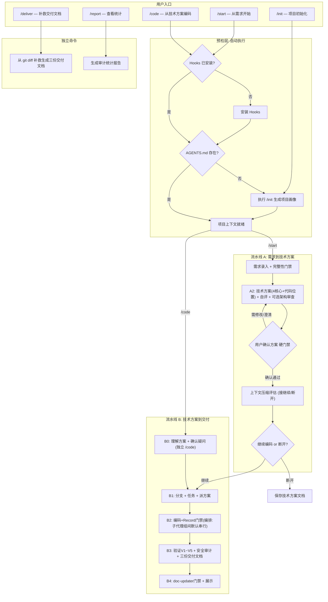

# Exoskeleton 用户手册（操作版）

本手册只保留操作步骤、核心流程图和跳转入口。机制解释、治理原理和设计细节统一以 `docs/plugin-core-workflow.md` 为准。

## 快速跳转

- 机制权威文档：`docs/plugin-core-workflow.md`
- 治理基线检查清单：`docs/governance-checklist.md`
- 故障处理 Runbook：`docs/operations-runbook.md`
- Profile 扩展模板：`docs/profile-extension-template.md`

## 平台要求

> **当前版本仅支持 Windows**（PowerShell 5.1+）。Hooks 脚本和安装脚本均基于 PowerShell 实现，macOS / Linux 支持在后续版本规划中。

## 标准操作步骤

### 1) 安装插件（每台机器一次）

执行环境与目录：

- 执行环境：`Windows PowerShell`
- 执行目录：任意目录（建议工具目录）

命令与作用：

```powershell
# 作用：克隆插件仓库到本地
git clone https://github.com/leikegeek/coding-exoskeleton

# 作用：进入插件仓库根目录，后续安装/验证命令都在这里执行
cd .\coding-exoskeleton

# 作用：安装插件到 Cursor 本地插件目录
.\install.ps1
```

已有仓库（可选）：

- 执行环境：`Windows PowerShell`
- 执行目录：已克隆的 `coding-exoskeleton` 仓库根目录

```powershell
# 作用：拉取远端最新代码（快进更新）
git pull --ff-only

# 作用：按最新代码重新安装插件
.\install.ps1
```

可选验证：

- 执行环境：`Windows PowerShell`
- 执行目录：`coding-exoskeleton` 仓库根目录

```powershell
# 作用：验证插件目录与组件完整性
.\verify.ps1 -PluginRoot "$env:USERPROFILE\.cursor\plugins\local\coding-exoskeleton"
```

### 2) 重启 Cursor

重启后，插件的 `skills` / `rules` / `commands` / `agents` 自动加载。

### 3) 在业务项目中开始使用

执行环境与目录：

- 执行环境：`Cursor 对话框`（不是 PowerShell）
- 执行目录：业务项目根目录（在 Cursor 中打开该项目）

命令与作用：

```text
# 作用：从需求走流水线 A（需求→方案→自评/审查），方案须经用户硬门禁确认；选「继续」后再进入编码/交付
/start SV-34577 需求描述或需求文档

# 作用：从已有技术方案直接进入编码与交付流程
/code SV-34577 @docs/design/SV-34577-tech-design.md

# 作用：手动初始化或重建项目画像（AGENTS.md + techStack 配置）
/init

# 作用：在非标准流程下补救生成交付文档
/deliver

# 作用：查看 hooks 审计统计与治理指标
/report
```

首次在项目中使用会自动引导安装 Hooks 与生成 `AGENTS.md`。

`/init` 也会可选引导配置个人作者信息，用于新建代码文件的作者注释（如 Java `@author`）。该配置保存到用户目录：

```text
~/.cursor/coding-exoskeleton/user-config.json
```

该文件不在业务项目目录内，不会进入代码仓库；作者信息也不会写入 `AGENTS.md` 或 `.cursor/harness-config.json`。

如果业务项目已经存在 `AGENTS.md`，`/init` 会额外提供「仅配置个人作者信息」选项；选择该项只检查/生成全局 `user-config.json`，不会改写项目画像或项目配置。选择「跳过」则不会配置作者信息。

已有业务仓库（可选）：

- 若你已在本地有业务仓库，只需在 Cursor 中直接打开该业务仓库目录，然后执行上述 `/start` 或 `/code`。
- 无需在业务仓库中再执行 `install.ps1`（安装脚本只在插件仓库执行）。

## 核心流程图



> **读图要点**：需求进入 A2 前先过完整性门禁；默认技术方案只保留 4 个核心部分，并必须写清代码实施位置；只有用户明确要求架构设计方案时才使用 8 部分架构模板。A2 自评/审查后**必须先**经用户确认硬门禁；B2 每个任务/子代理组都有 Record 门禁；B3 为 V1~V5 验证循环 **PASS 后**再做安全审计，验证过程写入机器状态，最终只交付三份正式文档（详见 `docs/plugin-core-workflow.md`）。

## 命令速查

- `/init`：生成/更新项目画像 `AGENTS.md`
- `/start`：需求到技术方案（流水线 A）
- `/code`：技术方案到交付（流水线 B）
- `/deliver`：补救生成交付文档
- `/report`：查看治理统计

命令机制、门禁、产物细节统一查看：`docs/plugin-core-workflow.md`

## 新增机制速览（v1.0.3）

| 机制 | 作用 | 触发时机 |
|------|------|---------|
| 战略性上下文压缩 | 阶段切换时压缩上下文释放 token，快照保护关键信息 | A→B 衔接、B0→B1、B1→B2、B2→B3 等阶段切换点 |
| 结构化验证循环 | 五维度门禁（构建/测试/性能/对齐/规范），增量重验 | B3 审查阶段，由 `verification-loop` skill 编排 |
| 专职子代理 | 架构审查、TDD 检查、构建修复、安全审计、文档检查 | A2（architect）、B2（tdd-guide）、B3（build-error-resolver / security-reviewer）、B4（doc-updater） |
| 实施进度追踪 | 技术方案文档中自动维护进度段落，支持跨会话续做 | B1 初始化、B2 每个任务完成后更新、B3/B4 更新状态 |
| 轻量技术方案 | 普通需求默认 4 段式；仅明确要求架构设计时使用 8 段架构模板 | A2 技术方案设计 |
| 需求完整性门禁 | 内部检查完整需求信息，只向用户确认阻断性缺口 | A1 结束、进入 A2 前 |
| Record 门禁 | 每个任务完成点必须维护变更清单和实施进度，缺失则不得进入下一任务或 B3 | B2 编码阶段 |
| 子代理上下文收窄 | 子代理只接收任务、方案摘录、项目摘要和必要规则，避免传全文 | B2 编排模式 |
| 机器状态验证记录 | V1~V5 过程状态写入 `docs/delivery/.state/SV-xxxxx-verification.json`，用于断点续验，不作为交付文档 | B3 验证循环 |
| 三份交付文档门禁 | `changelist`、`tech-ref`、`review-report` 三类正式文档齐套后才可交付；验证摘要写入 `review-report` | B3 收口、B4 展示前 |

## 进阶与运维入口

- 治理基线检查：`docs/governance-checklist.md`
- 异常处理与恢复：`docs/operations-runbook.md`
- 新技术栈 Profile 扩展：`docs/profile-extension-template.md`
